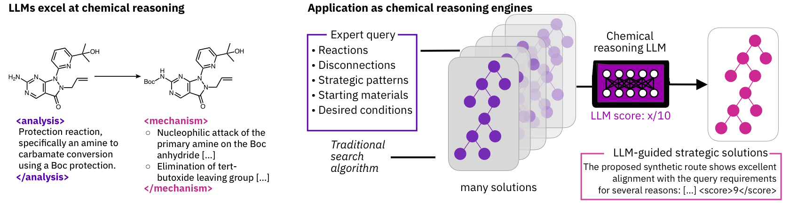

# Chemical Reasoning in LLMs for Synthesis Planning and Mechanism Elucidation

[](https://github.com/schwallergroup/steer)
[](https://doi.org/10.48550/arXiv.2503.08537)
[](https://img.shields.io/pypi/v/steer)
[](https://img.shields.io/pypi/pyversions/steer)
[](https://steer.readthedocs.io/en/latest/?badge=latest)
[](https://github.com/psf/black)

<p align="center">
  
</p>


## Overview

This repository contains the implementation of a novel framework that leverages LLMs as chemical reasoning engines to guide traditional search algorithms in chemistry. Our approach demonstrates how LLMs can be effectively used for:

1. **Strategy-aware Retrosynthetic Planning**: Enable chemists to specify desired synthetic strategies in natural language and find routes that satisfy these constraints.
2. **Mechanism Elucidation**: Guide the search for plausible reaction mechanisms by combining chemical principles with systematic exploration.

## Key Features

- 🧪 Natural language specification of synthetic strategies
- 🔍 LLM-guided search through chemical space
- 📊 Benchmark datasets for both synthesis planning and mechanism elucidation
- 🤖 Support for multiple LLM providers (Claude, GPT-4, DeepSeek)

## Installation

```bash
# Install from PyPI (TBD)
pip install steer

# Install from source
pip install git+https://github.com/schwallergroup/steer.git
```

## Quick Start

### Steerable Synthesis Planning

```bash
# Run the complete synthesis benchmark
steer synth --model=claude-3-5-sonnet bench

# Run a single task
steer synth --model=claude-3-5-sonnet bench --task=ea8df340d54596eda93e23f04dff3a9b
```

### Mechanism Finding

```bash
# Run mechanism elucidation benchmark
steer mech --model=claude-3-5-sonnet bench
```

## Benchmarks

The repository includes two main benchmarks:

### Synthesis Planning Benchmark
- Multiple target molecules of varying complexity
- Strategic constraints specified in natural language
- Evaluation metrics for route-to-prompt alignment

### Mechanism Elucidation Benchmark
- 12 diverse organic reactions
- Ground truth mechanisms with elementary steps
- Performance metrics for mechanism prediction

## Citation

If you use this work in your research, please cite:

```bibtex
@misc{bran2025chemicalreasoningllmsunlocks,
      title={Chemical reasoning in LLMs unlocks steerable synthesis planning and reaction mechanism elucidation}, 
      author={Andres M Bran and Theo A Neukomm and Daniel P Armstrong and Zlatko Jončev and Philippe Schwaller},
      year={2025},
      eprint={2503.08537},
      archivePrefix={arXiv},
      primaryClass={cs.AI},
      url={https://arxiv.org/abs/2503.08537}, 
}
```

## Development

<details>
<summary>Click to expand development instructions</summary>

### Setup Development Environment

```bash
git clone https://github.com/schwallergroup/steer.git
cd steer
pip install -e .
```

### Running Tests

```bash
pip install tox
tox
```

</details>

## License

[MIT License](LICENSE)

## Contributors

- Andres M Bran
- Théo A. Neukomm
- Daniel Armstrong
- Zlatko Jončev
- Philippe Schwaller

## Contact

For questions and feedback:
- 📧 Email: andres.marulandabran@epfl.ch, philippe.schwaller@epfl.ch
- 🌐 [Schwaller Group Website](https://schwallergroup.github.io)
